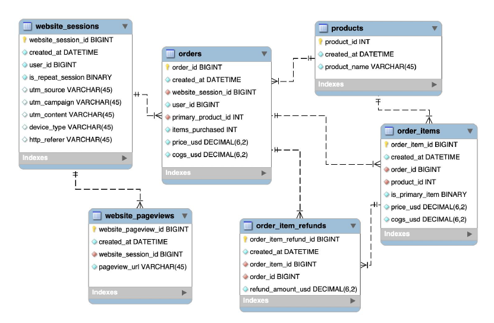

# THE OBJECTIVE

I'm tasked with assisting in conveying a compelling narrative to potential investors. The objective is to utilize SQL for extracting and analyzing traffic and website performance data, creating a growth story that resonates with the CEO's vision. The focus is on showcasing the impact of marketing channel activities and website improvements, flexing analytical skills to assure investors of the company's serious commitment to data-driven strategies. The project revolves around not just extracting and analyzing data but effectively communicating a story of rapid growth and performance optimization to stakeholders.



## Task 1: Volume Growth Analysis

- [ ] Pull overall session and order volume trended by quarter for the life of the business.
- [ ] Decide on how to handle the most recent incomplete quarter.

```
SELECT 
	YEAR(website_sessions.created_at) AS yr,
	QUARTER(website_sessions.created_at) AS qtr, 
	COUNT(DISTINCT website_sessions.website_session_id) AS sessions, 
    COUNT(DISTINCT orders.order_id) AS orders
FROM website_sessions 
	LEFT JOIN orders
		ON website_sessions.website_session_id = orders.website_session_id
GROUP BY 1,2
ORDER BY 1,2
;
```
| yr   | qtr | sessions | orders |
|------|---------|----------|--------|
| 2012 | 1       | 1879     | 60     |
| 2012 | 2       | 11433    | 347    |
| 2012 | 3       | 16892    | 684    |
| 2012 | 4       | 32266    | 1495   |
| 2013 | 1       | 19833    | 1273   |
| 2013 | 2       | 24745    | 1718   |
| 2013 | 3       | 27663    | 1840   |
| 2013 | 4       | 40540    | 2616   |
| 2014 | 1       | 46779    | 3069   |
| 2014 | 2       | 53129    | 3848   |
| 2014 | 3       | 57141    | 4035   |
| 2014 | 4       | 76373    | 5908   |
| 2015 | 1       | 64198    | 5420   |

Our business is on the rise! The latest numbers, even though the last quarter is incomplete, show strong growth in both sessions and order volumes. Things are looking up! 
For the last incomplete quarter, we've opted to exclude it from our analysis to ensure a consistent and reliable trend across complete data points.
## Task 2: Showcase Efficiency Improvements

- [ ] Showcase quarterly figures, since the launch, for session-to-order conversion rate.
- [ ] Showcase quarterly figures, since the launch, for revenue per order.
- [ ] Showcase quarterly figures, since the launch, for revenue per session.
```
SELECT 
	YEAR(website_sessions.created_at) AS yr,
	QUARTER(website_sessions.created_at) AS qtr, 
	COUNT(DISTINCT orders.order_id)/COUNT(DISTINCT website_sessions.website_session_id) AS session_to_order_conv_rate, 
    SUM(price_usd)/COUNT(DISTINCT orders.order_id) AS revenue_per_order, 
    SUM(price_usd)/COUNT(DISTINCT website_sessions.website_session_id) AS revenue_per_session
FROM website_sessions 
	LEFT JOIN orders
		ON website_sessions.website_session_id = orders.website_session_id
GROUP BY 1,2
ORDER BY 1,2
;
```
| yr   | qtr | sessions_to_order_cov_rate | revenue_per_order | revenue_per_session |
|------|-----|---------------------------|-------------------|----------------------|
| 2012 | 1   | 0.0319                    | 49.990000         | 1.596275             |
| 2012 | 2   | 0.0304                    | 49.990000         | 1.517233             |
| 2012 | 3   | 0.0405                    | 49.990000         | 2.024222             |
| 2012 | 4   | 0.0463                    | 49.990000         | 2.316217             |
| 2013 | 1   | 0.0642                    | 52.142396         | 3.346809             |
| 2013 | 2   | 0.0694                    | 51.538312         | 3.578211             |
| 2013 | 3   | 0.0665                    | 51.734533         | 3.441114             |
| 2013 | 4   | 0.0645                    | 54.715688         | 3.530741             |
| 2014 | 1   | 0.0656                    | 62.160684         | 4.078136             |
| 2014 | 2   | 0.0724                    | 64.374207         | 4.662462             |
| 2014 | 3   | 0.0706                    | 64.494949         | 4.554298             |
| 2014 | 4   | 0.0774                    | 63.793497         | 4.934885             |
| 2015 | 1   | 0.0844                    | 62.799917         | 5.301965             |

The session-to-order conversion rate surged from 3% to approximately 8% in the latest quarter, showcasing a substantial improvement in website engagement. Concurrently, the revenue per order witnessed significant growth, and the revenue per session skyrocketed from $1.59 to over $5, indicating a remarkable increase in the value derived from each customer interaction.

## Task 3: Growth Analysis of Specific Channels

- [ ] Pull quarterly orders from Gsearch nonbrand, Bsearch nonbrand, brand search overall, organic search, and direct type-in.
```
SELECT 
	YEAR(website_sessions.created_at) AS yr,
	QUARTER(website_sessions.created_at) AS qtr, 
    COUNT(DISTINCT CASE WHEN utm_source = 'gsearch' AND utm_campaign = 'nonbrand' THEN orders.order_id ELSE NULL END) AS gsearch_nonbrand_orders, 
    COUNT(DISTINCT CASE WHEN utm_source = 'bsearch' AND utm_campaign = 'nonbrand' THEN orders.order_id ELSE NULL END) AS bsearch_nonbrand_orders, 
    COUNT(DISTINCT CASE WHEN utm_campaign = 'brand' THEN orders.order_id ELSE NULL END) AS brand_search_orders,
    COUNT(DISTINCT CASE WHEN utm_source IS NULL AND http_referer IS NOT NULL THEN orders.order_id ELSE NULL END) AS organic_search_orders,
    COUNT(DISTINCT CASE WHEN utm_source IS NULL AND http_referer IS NULL THEN orders.order_id ELSE NULL END) AS direct_type_in_orders
    
FROM website_sessions 
	LEFT JOIN orders
		ON website_sessions.website_session_id = orders.website_session_id
GROUP BY 1,2
ORDER BY 1,2
```
| yr   | qtr | gsearch_nonbrand_orders | bsearch_nonbrand_orders | brand_search_orders | organic_search_orders | direct_type_in_orders |
|------|-----|-------------------------|-------------------------|----------------------|------------------------|------------------------|
| 2012 | 1   | 60                      | 0                       | 0                    | 0                      | 0                      |
| 2012 | 2   | 291                     | 0                       | 20                   | 15                     | 21                     |
| 2012 | 3   | 482                     | 82                      | 48                   | 40                     | 32                     |
| 2012 | 4   | 913                     | 311                     | 88                   | 94                     | 89                     |
| 2013 | 1   | 766                     | 183                     | 108                  | 125                    | 91                     |
| 2013 | 2   | 1114                    | 237                     | 114                  | 134                    | 119                    |
| 2013 | 3   | 1132                    | 245                     | 153                  | 167                    | 143                    |
| 2013 | 4   | 1657                    | 291                     | 248                  | 223                    | 197                    |
| 2014 | 1   | 1667                    | 344                     | 354                  | 338                    | 311                    |
| 2014 | 2   | 2208                    | 427                     | 410                  | 436                    | 367                    |
| 2014 | 3   | 2259                    | 434                     | 432                  | 445                    | 402                    |
| 2014 | 4   | 3248                    | 683                     | 615                  | 605                    | 532                    |
| 2015 | 1   | 3025                    | 581                     | 622                  | 640                    | 552                    |

The investor would be particularly interested in the increase of brand-search-orders, organic-search-orders, and direct-type-in-orders. Because with time business are getting out of dependency on paid campaigns.

## Task 4: Analyze Session-to-Order Conversion Rate Trends

- [ ] Show quarterly trends for session-to-order conversion rates.
- [ ] Break down the analysis for Gsearch nonbrand, Bsearch nonbrand, brand search overall, organic search, and direct type-in.
- [ ] Make note of any periods with significant improvements or optimizations.
```
SELECT 
	YEAR(website_sessions.created_at) AS yr,
	QUARTER(website_sessions.created_at) AS qtr, 
    COUNT(DISTINCT CASE WHEN utm_source = 'gsearch' AND utm_campaign = 'nonbrand' THEN orders.order_id ELSE NULL END)
		/COUNT(DISTINCT CASE WHEN utm_source = 'gsearch' AND utm_campaign = 'nonbrand' THEN website_sessions.website_session_id ELSE NULL END) AS gsearch_nonbrand_conv_rt, 
    COUNT(DISTINCT CASE WHEN utm_source = 'bsearch' AND utm_campaign = 'nonbrand' THEN orders.order_id ELSE NULL END) 
		/COUNT(DISTINCT CASE WHEN utm_source = 'bsearch' AND utm_campaign = 'nonbrand' THEN website_sessions.website_session_id ELSE NULL END) AS bsearch_nonbrand_conv_rt, 
    COUNT(DISTINCT CASE WHEN utm_campaign = 'brand' THEN orders.order_id ELSE NULL END) 
		/COUNT(DISTINCT CASE WHEN utm_campaign = 'brand' THEN website_sessions.website_session_id ELSE NULL END) AS brand_search_conv_rt,
    COUNT(DISTINCT CASE WHEN utm_source IS NULL AND http_referer IS NOT NULL THEN orders.order_id ELSE NULL END) 
		/COUNT(DISTINCT CASE WHEN utm_source IS NULL AND http_referer IS NOT NULL THEN website_sessions.website_session_id ELSE NULL END) AS organic_search_conv_rt,
    COUNT(DISTINCT CASE WHEN utm_source IS NULL AND http_referer IS NULL THEN orders.order_id ELSE NULL END) 
		/COUNT(DISTINCT CASE WHEN utm_source IS NULL AND http_referer IS NULL THEN website_sessions.website_session_id ELSE NULL END) AS direct_type_in_conv_rt
FROM website_sessions 
	LEFT JOIN orders
		ON website_sessions.website_session_id = orders.website_session_id
GROUP BY 1,2
ORDER BY 1,2
;
```
| yr   | qtr | gsearch_nonbrand_conv_rt | bsearch_nonbrand_conv_rt | brand_search_conv_rt | organic_search_conv_rt | direct_type_in_conv_rt |
|------|-----|--------------------------|--------------------------|-----------------------|------------------------|------------------------|
| 2012 | 1   | 0.0324                   | 0.0000                   | 0.0000                | 0.0000                 |                      |
| 2012 | 2   | 0.0284                   | 0.0526                   | 0.0359                | 0.0536                 |                      |
| 2012 | 3   | 0.0384                   | 0.0408                   | 0.0602                | 0.0498                 | 0.0443                |
| 2012 | 4   | 0.0436                   | 0.0497                   | 0.0531                | 0.0539                 | 0.0537                |
| 2013 | 1   | 0.0612                   | 0.0693                   | 0.0703                | 0.0753                 | 0.0614                |
| 2013 | 2   | 0.0685                   | 0.0690                   | 0.0679                | 0.0760                 | 0.0735                |
| 2013 | 3   | 0.0639                   | 0.0697                   | 0.0703                | 0.0734                 | 0.0719                |
| 2013 | 4   | 0.0629                   | 0.0601                   | 0.0801                | 0.0694                 | 0.0647                |
| 2014 | 1   | 0.0693                   | 0.0704                   | 0.0839                | 0.0756                 | 0.0765                |
| 2014 | 2   | 0.0702                   | 0.0695                   | 0.0804                | 0.0797                 | 0.0738                |
| 2014 | 3   | 0.0703                   | 0.0698                   | 0.0756                | 0.0733                 | 0.0702                |
| 2014 | 4   | 0.0782                   | 0.0841                   | 0.0812                | 0.0784                 | 0.0748                |
| 2015 | 1   | 0.0861                   | 0.0850                   | 0.0852                | 0.0821                 | 0.0775                |

Throughout the observed period, there is a consistent upward trajectory in all metrics, indicating sustained growth. Particularly noteworthy is the substantial growth witnessed in the first quarter of 2013, underscoring a significant and impactful expansion in performance during that specific timeframe.
## Task 5: Monthly Revenue and Margin Analysis by Product

- [ ] Pull monthly trends for revenue and margin by product.
- [ ] Include total sales and revenue in the analysis.
- [ ] Make notes regarding any observed patterns or seasonality.
```
SELECT
	YEAR(created_at) AS yr, 
    MONTH(created_at) AS mo, 
    SUM(CASE WHEN product_id = 1 THEN price_usd ELSE NULL END) AS mrfuzzy_rev,
    SUM(CASE WHEN product_id = 1 THEN price_usd - cogs_usd ELSE NULL END) AS mrfuzzy_marg,
    SUM(CASE WHEN product_id = 2 THEN price_usd ELSE NULL END) AS lovebear_rev,
    SUM(CASE WHEN product_id = 2 THEN price_usd - cogs_usd ELSE NULL END) AS lovebear_marg,
    SUM(CASE WHEN product_id = 3 THEN price_usd ELSE NULL END) AS birthdaybear_rev,
    SUM(CASE WHEN product_id = 3 THEN price_usd - cogs_usd ELSE NULL END) AS birthdaybear_marg,
    SUM(CASE WHEN product_id = 4 THEN price_usd ELSE NULL END) AS minibear_rev,
    SUM(CASE WHEN product_id = 4 THEN price_usd - cogs_usd ELSE NULL END) AS minibear_marg,
    SUM(price_usd) AS total_revenue,  
    SUM(price_usd - cogs_usd) AS total_margin
FROM order_items 
GROUP BY 1,2
ORDER BY 1,2
;
```
Partial Output is shown below
|   yr | qtr | mrfuzzy_rev | mrfuzzy_marg | lovebear_rev | lovebear_marg | birthdaybear_rev | birthdaybear_marg | minibear_rev | minibear_marg | total_revenue | total_margin |
| --- | --- | ----------- | ------------ | ------------- | -------------- | ------------------ | ------------------ | ------------ | ------------- | ------------- | ------------ |
| 2012 | 3   | 2999.40     | 1830.00      | 0             | 0              | 0                 | 0                 | 0            | 0             | 2999.40       | 1830.00      |
| 2012 | 4   | 4949.01     | 3019.50      | 0             | 0              | 0                 | 0                 | 0            | 0             | 4949.01       | 3019.50      |
| 2012 | 5   | 5398.92     | 3294.00      | 0             | 0              | 0                 | 0                 | 0            | 0             | 5398.92       | 3294.00      |
| 2012 | 6   | 6998.60     | 4270.00      | 0             | 0              | 0                 | 0                 | 0            | 0             | 6998.60       | 4270.00      |
| 2012 | 7   | 8448.31     | 5154.50      | 0             | 0              | 0                 | 0                 | 0            | 0             | 8448.31       | 5154.50      |
| 2012 | 8   | 11397.72    | 6954.00      | 0             | 0              | 0                 | 0                 | 0            | 0             | 11397.72      | 6954.00      |
| 2012 | 9   | 14347.13    | 8753.50      | 0             | 0              | 0                 | 0                 | 0            | 0             | 14347.13      | 8753.50      |
| 2012 | 10 | 18546.29    | 11315.50     | 0             | 0              | 0                 | 0                 | 0            | 0             | 18546.29      | 11315.50     |
| 2012 | 11 | 30893.82    | 18849.00     | 0             | 0              | 0                 | 0                 | 0            | 0             | 30893.82      | 18849.00     |
| 2012 | 12 | 25294.94    | 15433.00     | 0             | 0              | 0                 | 0                 | 0            | 0             | 25294.94      | 15433.00     |
| 2013 | 1   | 17146.57    | 10461.50     | 2819.53       | 1762.50        | 0                 | 0                 | 0            | 0             | 19966.10      | 12224.00     |
| 2013 | 2   | 16796.64    | 10248.00     | 9718.38       | 6075.00        | 0                 | 0                 | 0            | 0             | 26515.02      | 16323.00     |
| 2013 | 3   | 15996.80    | 9760.00      | 3899.35       | 2437.50        | 0                 | 0                 | 0            | 0             | 19896.15      | 12197.50     |
| 2013 | 4   | 22945.41    | 13999.50     | 5639.06       | 3525.00        | 0                 | 0                 | 0            | 0             | 28584.47      | 17524.50     |
| 2013 | 5   | 24445.11    | 14914.50     | 4919.18       | 3075.00        | 0                 | 0                 | 0            | 0             | 29364.29      | 17989.50     |
| 2013 | 6   | 25144.97    | 15341.50     | 5399.10       | 3375.00        | 0                 | 0                 | 0            | 0             | 30544.07      | 18716.50     |
| 2013 | 7   | 25444.91    | 15524.50     | 5699.05       | 3562.50        | 0                 | 0                 | 0            | 0             | 31143.96      | 19087.00     |
| 2013 | 8   | 25494.90    | 15555.00     | 5879.02       | 3675.00        | 0                 | 0                 | 0            | 0             | 31373.92      | 190

**We observed a big pop in November and December every year. This is due to the holiday season for US students which is good for online retail sales.**
**Also, we see a large spike in love bear revenue around the Valentine's Day holiday.**

## Task 6: Let’s dive deeper into the impact of introducing new products. Please pull monthly sessions to the /products page, and show how the % of those sessions clicking through another page has changed over time, along with a view of how conversion from /products to placing an order has improved.

- [ ] Pull monthly sessions to the /products page.
- [ ] Show the change in the percentage of those sessions clicking through to another page over time.
- [ ] Provide a view of how the conversion from /products to placing an order has improved.
```
-- First, identifying all the views of the /products page
CREATE TEMPORARY TABLE products_pageviews
SELECT
	website_session_id, 
    website_pageview_id, 
    created_at AS saw_product_page_at

FROM website_pageviews 
WHERE pageview_url = '/products'
;
```
```
SELECT 
	YEAR(saw_product_page_at) AS yr, 
    MONTH(saw_product_page_at) AS mo,
    COUNT(DISTINCT products_pageviews.website_session_id) AS sessions_to_product_page, 
    COUNT(DISTINCT website_pageviews.website_session_id) AS clicked_to_next_page, 
    COUNT(DISTINCT website_pageviews.website_session_id)/COUNT(DISTINCT products_pageviews.website_session_id) AS clickthrough_rt,
    COUNT(DISTINCT orders.order_id) AS orders,
    COUNT(DISTINCT orders.order_id)/COUNT(DISTINCT products_pageviews.website_session_id) AS products_to_order_rt
FROM products_pageviews
	LEFT JOIN website_pageviews 
		ON website_pageviews.website_session_id = products_pageviews.website_session_id -- same session
        AND website_pageviews.website_pageview_id > products_pageviews.website_pageview_id -- they had another page AFTER
	LEFT JOIN orders 
		ON orders.website_session_id = products_pageviews.website_session_id
GROUP BY 1,2
;
```
| yr   | mo | sessions_to_product_page | clicked_to_next_page | clickthrough_rt | orders | products_to_order_rt |
| ---- | -- | ------------------------ | --------------------- | ---------------- | ------ | ---------------------- |
| 2012 | 3  | 743                      | 530                   | 0.7133           | 60     | 0.0808                 |
| 2012 | 4  | 1447                     | 1029                  | 0.7111           | 99     | 0.0684                 |
| 2012 | 5  | 1584                     | 1135                  | 0.7165           | 108    | 0.0682                 |
| 2012 | 6  | 1752                     | 1247                  | 0.7118           | 140    | 0.0799                 |
| 2012 | 7  | 2018                     | 1438                  | 0.7126           | 169    | 0.0837                 |
| 2012 | 8  | 3012                     | 2198                  | 0.7297           | 228    | 0.0757                 |
| 2012 | 9  | 3126                     | 2258                  | 0.7223           | 287    | 0.0918                 |
| 2012 | 10 | 4030                     | 2948                  | 0.7315           | 371    | 0.0921                 |
| 2012 | 11 | 6743                     | 4849                  | 0.7191           | 618    | 0.0917                 |
| 2012 | 12 | 5013                     | 3620                  | 0.7221           | 506    | 0.1009                 |
| 2013 | 1  | 3380                     | 2595                  | 0.7678           | 391    | 0.1157                 |
| 2013 | 2  | 3685                     | 2803                  | 0.7607           | 497    | 0.1349                 |
| 2013 | 3  | 3371                     | 2576                  | 0.7642           | 385    | 0.1142                 |
| 2013 | 4  | 4362                     | 3356                  | 0.7694           | 553    | 0.1268                 |
| 2013 | 5  | 4684                     | 3609                  | 0.7705           | 571    | 0.1219                 |
| 2013 | 6  | 4600                     | 3536                  | 0.7687           | 594    | 0.1291                 |
| 2013 | 7  | 5020                     | 3890                  | 0.7749           | 603    | 0.1201                 |
| 2013 | 8  | 5226                     | 3951                  | 0.7560           | 608    | 0.1163                 |
| 2013 | 9  | 5399                     | 4072                  | 0.7542           | 629    | 0.1165                 |
| 2013 | 10 | 6038                     | 4564                  | 0.7559           | 708    | 0.1173                 |
| 2013 | 11 | 7886                     | 5900                  | 0.7482           | 861    | 0.1092                 |
| 2013 | 12 | 8840                     | 7026                  | 0.7948           | 1047   | 0.1184                 |
| 2014 | 1  | 7790                     | 6387                  | 0.8199           | 983    | 0.1262                 |
| 2014 | 2  | 7960                     | 6485                  | 0.8147           | 1021   | 0.1283                 |
| 2014 | 3  | 8110                     | 6669                  | 0.8223           | 1065   | 0.1313                 |
| 2014 | 4  | 9744                     | 7958                  | 0.8167           | 1241   | 0.1274                 |
| 2014 | 5  | 10261                    | 8465                  | 0.8250           | 1368   | 0.1333                 |
| 2014 | 6  | 10011                    | 8260                  | 0.8251           | 1239   | 0.1238                 |
| 2014 | 7  | 10837                    | 8958                  | 0.8266           | 1287   | 0.1188                 |
| 2014 | 8  | 10768                    | 8980                  | 0.8340           | 1324   | 0.1230                 |
| 2014 | 9  | 11128                    | 9156                  | 0.8228           | 1424   | 0.1280                 |
| 2014 | 10 | 12335                    | 10235                 | 0.8298           | 1609   | 0.1304                 |
| 2014 | 11 | 14476                    | 12020                 | 0.8303           | 1985   | 0.1371                 |
| 2014 | 12 | 17240                    | 14609                 | 0.8474           | 2314   | 0.1342                 |
| 2015 | 1  | 15217                    | 12992                 | 0.8538           | 2099   | 0.1379                 |
| 2015 | 2  | 14373                    | 12187                 | 0.8479           | 2067   | 0.1438                 |
| 2015 | 3  | 9022                     | 7723                  | 0.8560           | 1254   | 0.1390                 |


The click-through rate has shown a significant increase, rising from approximately 70% at the inception of the business to an impressive 85% in the most recent month. Similarly, the conversion rate from viewing the product page to completing a full paying order has experienced notable growth, climbing from 8% and 6% initially to around 14% in recent months. These improvements underscore the appeal of new products, demonstrating their success in engaging and converting customers.

## Task 7: Analyze Cross-Selling Impact of 4th Product Introduction - (Our 4th product was available as a primary product on December 05, 2014 (it was previously only a cross item). My task was to pull sales data since then and show how well each product cross-sells from one another.

- [ ] Pull sales data since December 05, 2014, for the 4th product introduced as a primary product.
- [ ] Evaluate the cross-selling performance of each product to one another.
```
CREATE TEMPORARY TABLE primary_products
SELECT 
	order_id, 
    primary_product_id, 
    created_at AS ordered_at
FROM orders 
WHERE created_at > '2014-12-05' -- when the 4th product was added (says so in question)
;
```
```
SELECT
	primary_products.*, 
    order_items.product_id AS cross_sell_product_id
FROM primary_products
	LEFT JOIN order_items 
		ON order_items.order_id = primary_products.order_id
        AND order_items.is_primary_item = 0; -- only bringing in cross-sells;
```
First, we filtered based on the date when our 4th product was introduced. Subsequently, we selected all primary products from our temporary table, only joining orders where is_primary_id = 0 to specifically obtain cross-sells.

```

SELECT 
	primary_product_id, 
    COUNT(DISTINCT order_id) AS total_orders, 
    COUNT(DISTINCT CASE WHEN cross_sell_product_id = 1 THEN order_id ELSE NULL END) AS _xsold_p1,
    COUNT(DISTINCT CASE WHEN cross_sell_product_id = 2 THEN order_id ELSE NULL END) AS _xsold_p2,
    COUNT(DISTINCT CASE WHEN cross_sell_product_id = 3 THEN order_id ELSE NULL END) AS _xsold_p3,
    COUNT(DISTINCT CASE WHEN cross_sell_product_id = 4 THEN order_id ELSE NULL END) AS _xsold_p4,
    COUNT(DISTINCT CASE WHEN cross_sell_product_id = 1 THEN order_id ELSE NULL END)/COUNT(DISTINCT order_id) AS p1_xsell_rt,
    COUNT(DISTINCT CASE WHEN cross_sell_product_id = 2 THEN order_id ELSE NULL END)/COUNT(DISTINCT order_id) AS p2_xsell_rt,
    COUNT(DISTINCT CASE WHEN cross_sell_product_id = 3 THEN order_id ELSE NULL END)/COUNT(DISTINCT order_id) AS p3_xsell_rt,
    COUNT(DISTINCT CASE WHEN cross_sell_product_id = 4 THEN order_id ELSE NULL END)/COUNT(DISTINCT order_id) AS p4_xsell_rt
FROM
(
SELECT
	primary_products.*, 
    order_items.product_id AS cross_sell_product_id
FROM primary_products
	LEFT JOIN order_items 
		ON order_items.order_id = primary_products.order_id
        AND order_items.is_primary_item = 0 -- only bringing in cross-sells
) AS primary_w_cross_sell
GROUP BY 1;
```
| primary_product_id | total_orders | _xsold_p1 | _xsold_p2 | _xsold_p3 | _xsold_p4 | p1_xsell_rt | p2_xsell_rt | p3_xsell_rt | p4_xsell_rt |
|--------------------|--------------|-----------|-----------|-----------|-----------|--------------|--------------|--------------|--------------|
| 1                  | 4467         | 0         | 238       | 553       | 933       | 0.0000       | 0.0533       | 0.1238       | 0.2089       |
| 2                  | 1277         | 25        | 0         | 40        | 260       | 0.0196       | 0.0000       | 0.0313       | 0.2036       |
| 3                  | 929          | 84        | 40        | 0         | 208       | 0.0904       | 0.0431       | 0.0000       | 0.2239       |
| 4                  | 581          | 16        | 9         | 22        | 0         | 0.0275       | 0.0155       | 0.0379       | 0.0000       |

What we observe is that product 1, designated as the primary product, continues to be a significant contributor. An interesting finding is the effective cross-selling relationship between product 3 and product 1, while product 4 shows strong cross-sell connections with products 1, 2, and 3 (approximately 20%).
